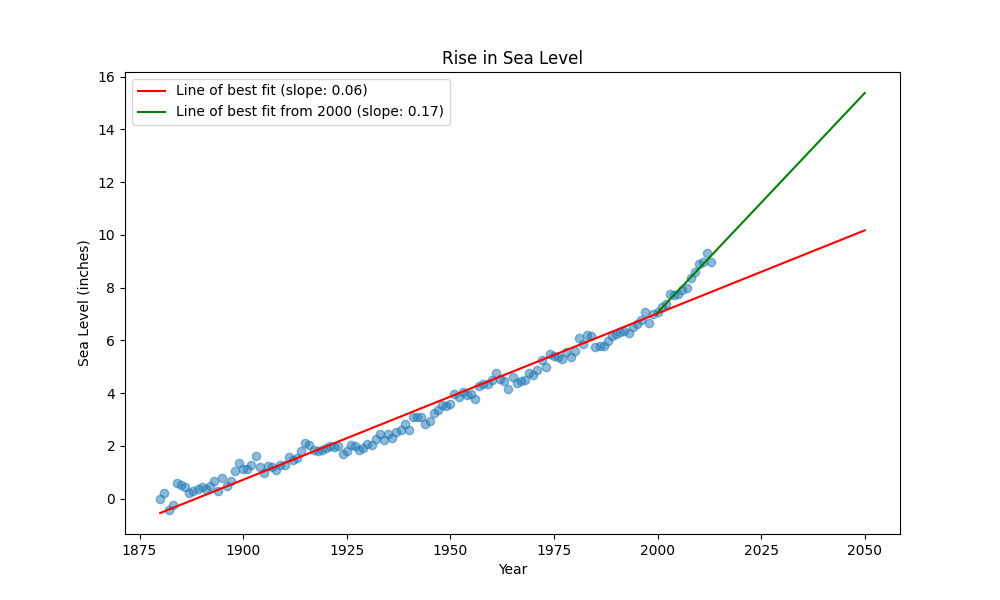

# Sea Level Predictor



## Overview
This project analyzes historical sea level data and predicts future sea level rise using linear regression. The analysis is visualized in a plot that shows both the historical data and two lines of best fit, providing insight into long-term and recent trends in sea level rise.

## Dataset
The data used in this project comes from the [EPA's sea level dataset](epa-sea-level.csv), which contains annual measurements of the global mean sea level (in inches) from 1880 to 2013, as well as error bounds and NOAA-adjusted values for some years.

## How It Works
- The program reads the CSV data and creates a scatter plot of the measured sea levels over time.
- **First line of best fit (red):** Calculated using all available data from 1880 to 2013. This line shows the long-term trend in sea level rise.
- **Second line of best fit (green):** Calculated using only data from the year 2000 onwards. This line highlights the more recent trend, which may differ from the long-term average.
- Both lines are extended to the year 2050 to visualize predicted future sea levels.

## Usage
1. Ensure you have Python and the required libraries installed (see `requirements.txt`).
2. Run the main script:
   ```bash
   python main.py
   ```
3. The script will generate a plot (`sea_level_plot.png`) and run unit tests to verify correctness.

## Output
The generated plot (`sea_level_plot.png`) will look like this:


- **Red line:** Line of best fit for all data (1880–2013)
- **Green line:** Line of best fit for data from 2000 onwards
- **Blue dots:** Actual measured sea levels

## Project Structure
- `sea_level_predictor.py` — Main analysis and plotting code
- `epa-sea-level.csv` — Source data
- `main.py` — Entrypoint for running the project and tests
- `test_module.py` — Unit tests for plot correctness
- `sea_level_plot.png` — Output plot

## License
This project is part of the freeCodeCamp Data Analysis with Python curriculum.
